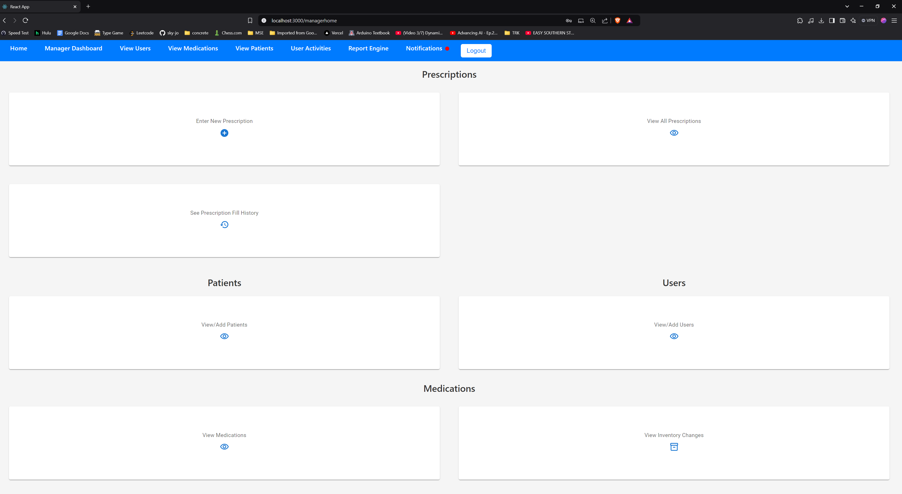

# Pharmacy Management and Point-of-Sale Web App

Developed in Fall 2024 by Skyler DeVaughn, Katelyn McLean, Oliver Seymour, Hsinwei Lin, CJ Reda, and Dalia Castro

## Table of Contents

<!-- 3. [Tech Stack](#tech-stack) -->
1. [Overview](#overview)
2. [Features](#features)
3. [Setup Instructions](#setup-instructions)
4. [Code Structure](#code-structure)
5. [Architecture](#architecture)
6. [Frontend](#frontend)
7. [Backend](#backend)
8. [API Documentation](#api-documentation)
9. [Screenshots](#screenshots)

## Overview

This is a complete Web App for managing a modern pharmacy, including managing prescriptions, inventory, employee accounts, and more, and selling items to customers with a point-of-sale.

Security and user experience were considered during all points of the development process, as well as future maintainability and extensibility.

### System Summary

This pharmacy management system is a robust and scalable solution designed to streamline pharmacy operations. It integrates modern technologies such as React, FastAPI, and PostgreSQL to provide a seamless user experience and efficient data management. The system's architecture ensures maintainability, security, and extensibility, making it an ideal choice for modern pharmacies looking to enhance their operational efficiency.

**Note:** more details on the system are below the 'Running the code' section.

Key users of this app include:

- Pharmacy Managers: can create and manage user (employee) accounts, manage and update inventory, view logs of all user actions and inventory changes, receive notifications for medications expiring soon or with low stock
- Pharmacists: can fill prescriptions, view employee accounts, view medication inventory, view the same logs as pharmacy managers, receive same notifications as pharmacy managers
- Pharmacy technicians: Can view medication inventory and checkout customers
- Cashiers: can checkout customers


## Table of Contents
<!-- 3. [Tech Stack](#tech-stack) -->
1. [Overview](#overview)
2. [Features](#features)
3. [Setup Instructions](#setup-instructions)
4. [Code Structure](#code-structure)
5. [Architecture](#architecture)
6. [Frontend](#frontend)
7. [Backend](#backend)
8. [API Documentation](#api-documentation)
9. [Screenshots](#screenshots)

## Features

### User-Facing Features

<!-- TODO!!! -->
- **Feature 1**: User authentication with role-based access control
    We used JWT (JSON Web Token) to perform user authentication and role-based access control. Each user will be given a token at login. When user login and perform restricted actions that only allows some pharmacy staff to perform, the backend will check if that user's token has the privillege to do so. If not, will return errors.

- **Feature 2**: Another feature (e.g., "Dynamic data visualization through interactive dashboards").


### Admin Features

- **Feature A**: Describe feature (e.g., "Ability to monitor and manage users").

## Setup Instructions

Follow these steps to run the project locally.

### Prerequisites

1. Install [Docker Desktop](https://www.docker.com/products/docker-desktop/)

2. Install [Python](https://www.python.org/)
3. Check Docker status, making sure it's properly installed

   ```shell
   docker --version
   docker-compose --version
   ```

### Installation and first-time setup

1. Clone the repository:

   ```bash
   git clone https://github.com/oliver-sey/pharmacy-management-system
   ```

2. Navigate to the project directory:

   ```bash
   cd pharmacy-management-system
   ```

3. Build Docker container

   You only need to run this command with the `--build` flag the first time or after changing the environment (importing a new package, etc).

   ```shell
   docker-compose up --build
   ```

   The Docker container should now be up and running, and the website should be available at [localhost:3000](http://localhost:3000) in your browser.

### Running Locally

1. Starting the container in a typical situation:

   Start the container:

   ```shell
   docker-compose up
   ```

2. Stop the container (stops the code):

   ```shell
   ctrl (control key) c
   ```

## Code Structure

The project is organized into the following directories:

- **frontend/**: Contains the React application for the user interface.

  - **src/**: Source code for the React components, pages, and utilities.
  - **public/**: Public assets and the main HTML file.
  - **build/**: Build output for the React application.
  - **Dockerfile**: Dockerfile for building the frontend container.
  - **package.json**: Configuration file for npm dependencies and scripts.

- **backend/**: Contains the FastAPI application for the backend logic.

  - **api_server/**: Source code for the FastAPI application, including models, schemas, and routes.
  - **database/**: SQL scripts and database-related files.
  - **tests/**: Unit tests for the backend.
  - **Dockerfile**: Dockerfile for building the backend container.
  - **requirements.txt**: List of Python dependencies.

- **docker-compose.yml**: Docker Compose file for orchestrating the frontend and backend containers.

This structure ensures a clear separation of concerns, making the project easy to navigate and maintain.

## Architecture

This project includes a **FastAPI** backend with **SQLAlchemy** models and schema design, a **PostgreSQL** database, a **React** frontend, and the use of **Docker** containers for easy deployment.

The project follows a **full-stack/client-server** architecture with the following components:

- **FastAPI Backend**: Provides RESTful API endpoints for the frontend to interact with the database.
- **SQLAlchemy**: ORM (Object Relational Mapper) used to define models and handle database interactions.
- **PostgreSQL Database**: Relational database used to persist data.
- **React Frontend**: User interface built using React.js that communicates with the backend API.
- **Docker**: Containerization tool for easy deployment and isolation of all components.

---

### Architecture Diagram

```text
+---------------------+      +---------------------+
|    React Frontend   | <--> |   FastAPI Backend   |
|    (User Interface) |      |    (API Server)     |
+---------------------+      +---------------------+
                                        |
                                        v
                             +---------------------+
                             |   SQLAlchemy ORM    |
                             |   (Models, Schema)  |
                             +---------------------+
                                        |
                                        v
                             +---------------------+
                             | PostgreSQL Database |
                             | (Data Persistence)  |
                             +---------------------+
```

### Tech Stack

| Layer    | Technology Used                 |
| -------- | ------------------------------- |
| Frontend | React (JavaScript), Material-UI |
| Backend  | FastAPI (Python), Pydantic      |
| Database | PostgreSQL                      |

### Interconnection

The frontend and backend are interconnected through RESTful APIs. The frontend makes HTTP requests to the backend to perform various operations. The backend processes these requests, interacts with the database, and returns the appropriate responses. Docker is used to containerize both the frontend and backend, ensuring a consistent and isolated environment for the application.

## Frontend

The frontend of the application is built using React and Material-UI. It provides a dynamic and responsive user interface that allows users to interact with the system seamlessly. Key features include:

- **Component-Based Architecture**: The frontend is structured into reusable components, making it easy to maintain and extend.
- **State Management**: React's state management is used to handle the application's state, ensuring a smooth user experience.
- **Form Validation**: Custom validation logic is implemented to ensure data integrity before submission.
- **API Integration**: The frontend communicates with the backend via RESTful APIs to fetch and submit data.

## Backend

The backend is powered by FastAPI, a modern, high-performance web framework for building APIs with Python. It handles the core logic and data processing of the application. Key features include:

- **Database Management**: PostgreSQL is used as the database to store structured data. SQLAlchemy is used for ORM (Object-Relational Mapping).
- **Authentication and Authorization**: Secure authentication mechanisms are implemented using JWT (JSON Web Tokens).
- **Data Validation**: Pydantic is used for data validation and serialization, ensuring that the data conforms to the expected schema.
- **API Endpoints**: FastAPI is used to define RESTful API endpoints for various operations such as managing prescriptions, inventory, and user accounts.

<!-- TODO -->

Key Actions
For Users:
[Briefly describe key actions users can perform.]
For Admins:
[Briefly describe admin functionalities.]
Screenshots

Home Page

Figure 5: Screenshot of the Home page.

Login Page

Figure 6: Screenshot of the login page.

Dashboard

Figure 7: User dashboard displaying data.

## API Documentation

The backend is built using **FastAPI**, with a **PostgreSQL** database managed through **SQLAlchemy**. This application exposes several RESTful API endpoints for authentication, user management, patient management, and password resetting. The backend also incorporates JWT-based authentication for secure API access.

---

### Key Components

### 1. **Database Connectivity**

The application uses **SQLAlchemy** for interacting with a PostgreSQL database. The `SessionLocal` object is used to manage database sessions.

##### Database Session Dependency

```python
def get_db():
    db = SessionLocal()
    try:
        yield db
    finally:
        db.close()
```

### 2. **Authentication Endpoints**

The authentication system in the backend is based on JSON Web Tokens (JWT). The following endpoints are responsible for handling user authentication, token issuance, and token verification:

#### **POST `/token`**

This endpoint is used for user authentication. It accepts the username (email) and password, verifies the credentials, and returns a JWT access token. This token is then used for subsequent requests to authenticate the user.

- **Input**: Username (email) and password.
- **Output**: A JWT token that the user can use for authorization in future requests.

#### **GET `/verify-token/{token}`**

This endpoint allows a user to verify whether their JWT token is valid. It decodes the token and checks its expiration time. If the token is valid, it returns a success message.

- **Input**: JWT token.
- **Output**: A message indicating if the token is valid.

### 3. **User Management Endpoints**

These endpoints manage user accounts and their details:

- **POST `/users/`**: Creates a new user. Allowed user: [Pharmacy Manager]
- **GET `/users/{user_id}`**: Retrieves details of a specific user. Allowed user: [Pharmacy Manager, Pharmacist]
- **DELETE `/users/{user_id}`**: Deletes a user if no prescriptions are associated. Allowed user: [Pharmacy Manager]
- **PUT `/users/{user_id}`**: Updates the details of an existing user. Allowed user: [Pharmacy Manager]
- **GET `/userslist/`**: Lists all users in the system. Allowed user: [Pharmacy Manager, Pharmacist]
- **PUT `/users/unlock/{user_id}`**: Unlocks a user account after it has been locked due to too many incorrect login attempts. Allowed user: [Pharmacy Manager]

**NOTE:** The endpoints below do not require authentication (a JWT) in the request. These are a very limited number of endpoints, and we intentionally only return very limited information.

These two endpoints are used on the `/setpassword` page so that a user can set the first password on their account. We cannot pass a JWT (token) to these endpoints because the user does not have a password yet and cannot create a token.

We found these endpoints to be necessary to the proper function of our system and made sure to make the system as secure as possible.

- **GET `/userslist/new/`**: Returns a list of emails and user ID's for accounts that have been newly created, but the user has not activated their account by setting a password yet. Allowed user: [Pharmacy Manager]
- **PUT `/users/{user_id}/setpassword`**: Sets a new password for a user account, only works if the account has not had a password before (i.e. it is a new account). Passwords are normally changed with the PUT `/users/{user_id}` endpoint.

---

### 4. **Patient Management Endpoints**

These endpoints handle patient records:

- **POST `/patient`**: Creates a new patient. Allowed user: all
- **GET `/patient/{patient_id}`**: Retrieves details of a specific patient. Allowed user: all
- **GET `/patients`**: Lists all patients in the system. Allowed user: all
- **PUT `/patient/{patient_id}`**: Updates a patient’s information. Allowed user: all
- **DELETE `/patient/{patient_id}`**: Deletes a patient and updates any associated prescriptions. Allowed user: [Pharmacy Manager]

---

### 5. **Medication CRUD Endpoints**

These endpoints are used to manage medications in the system:

- **POST `/medication/`**: Adds a new medication to the database. Allowed user: [Pharmacy Manager]
- **GET `/medication/{medication_id}`**: Retrieves details of a specific medication. Allowed user: [Pharmacy Manager, Pharmacist, pharmacy technician]
- **PUT `/medication/{medication_id}`**: Updates details of an existing medication. Allowed user: [Pharmacy Manager]
- **DELETE `/medication/{medication_id}`**: Deletes a specific medication from the system. Allowed user: [Pharmacy Manager]
- **GET `/medicationlist/`**: Lists all medications in the system. Allowed user: [Pharmacy Manager, Pharmacist, pharmacy technician]

---

### 6. **Prescription CRUD Endpoints**

These endpoints handle prescription management, including creation, updating, deletion, and filling:

- **GET `/prescriptions`**: Retrieves all prescriptions, optionally filtered by patient ID. Allowed user: all
- **GET `/prescription/{prescription_id}`**: Retrieves a specific prescription. Allowed user: all
- **POST `/prescription`**: Creates a new prescription. Allowed user: all
- **PUT `/prescription/{prescription_id}`**: Updates an existing prescription (unless it has been filled). Allowed user: all
- **DELETE `/prescription/{prescription_id}`**: Deletes a prescription. Allowed user: [ Pharmacy Manager ]
- **PUT `/prescription/{prescription_id}/fill`**: Marks a prescription as filled and updates inventory accordingly. Allowed user: [ Pharmacist ]

---

### 7. **Inventory Update Endpoints**

These endpoints manage changes to medication inventory, such as adding, filling, or selling medications:

- **POST `/inventory-updates`**: Creates an inventory update (used internally).
- **GET `/inventory-updates/{id}`**: Retrieves a specific inventory update. Allowed user: [Pharmacy Manager, Pharmacist]
- **GET `/inventory-updates`**: Lists all inventory updates, optionally filtered by activity type (e.g., "add", "fillpresc", "sellnonpresc"). Allowed user: [Pharmacy Manager, Pharmacist]

---

### 8. **User Activities CRUD Endpoints**

These endpoints track user activities, such as inventory updates and prescription fillings:

- **POST `/user-activities`**: Creates a new user activity (used internally). 
- **GET `/user-activities`**: Lists all user activities recorded in the system. Allowed user: [Pharmacy Manager, Pharmacist]

---

### 9. **Transaction CRUD Endpoints**

These endpoints manage transactions in the pharmacy system:

- **POST `/transaction`**: Creates a new transaction. Allowed user: [Pharmacy Manager, Pharmacist]
- **GET `/transaction/{transaction_id}`**: Retrieves a specific transaction. Allowed user: [Pharmacy Manager, Pharmacist]
- **GET `/transactions`**: Lists all transactions in the system. Allowed user: [Pharmacy Manager, Pharmacist]

---

## **Database Models**

These describe our database tables

### 1. **User**

Represents a user (employee) in the system (e.g., Pharmacy Manager, Technician, etc.). Patients (customers) do not get a user account and cannot login.

| Column Name   | Data Type                |
| ------------- | ------------------------ |
| id            | Integer (Primary Key)    |
| first_name    | String                   |
| last_name     | String                   |
| user_type     | SQLAlchemyEnum(UserType) |
| email         | String (Unique)          |
| password      | String                   |
| is_locked_out | Boolean (Default: True)  |

---

### 2. **Patient**

Represents a patient with personal and insurance details.

| Column Name            | Data Type             |
| ---------------------- | --------------------- |
| id                     | Integer (Primary Key) |
| first_name             | String                |
| last_name              | String                |
| date_of_birth          | Date                  |
| address                | String                |
| phone_number           | String                |
| email                  | String (Unique)       |
| insurance_name         | String                |
| insurance_group_number | String                |
| insurance_member_id    | String                |

---

### 3. **Prescription**

Represents a prescription given to a patient, including medication details.

| Column Name      | Data Type                    |
| ---------------- | ---------------------------- |
| id               | Integer (Primary Key)        |
| patient_id       | Integer (ForeignKey)         |
| user_entered_id  | Integer (ForeignKey)         |
| user_filled_id   | Integer (ForeignKey)         |
| date_prescribed  | Date (Default: current date) |
| filled_timestamp | DateTime (Nullable)          |
| medication_id    | Integer (ForeignKey)         |
| doctor_name      | String                       |
| quantity         | Integer                      |

---

### 4. **Medication**

Represents a medication, including its name, dosage, and inventory details.

| Column Name           | Data Type             |
| --------------------- | --------------------- |
| id                    | Integer (Primary Key) |
| name                  | String                |
| dosage                | String                |
| quantity              | Integer               |
| prescription_required | Boolean               |
| expiration_date       | Date                  |
| dollars_per_unit      | Float                 |

---

### 5. **UserActivity**

Tracks a user's activities in the system (e.g., login, logout, etc.).

| Column Name   | Data Type                        |
| ------------- | -------------------------------- |
| id            | Integer (Primary Key)            |
| user_id       | Integer (ForeignKey)             |
| activity_type | SQLAlchemyEnum(UserActivityType) |
| timestamp     | DateTime (Default: current time) |

---

### 6. **InventoryUpdate**

Represents changes to the inventory, such as adding or discarding medication.

| Column Name         | Data Type                           |
| ------------------- | ----------------------------------- |
| id                  | Integer (Primary Key)               |
| medication_id       | Integer (ForeignKey)                |
| user_activity_id    | Integer (ForeignKey)                |
| transaction_id      | Integer (ForeignKey, Nullable)      |
| quantity_changed_by | Integer                             |
| timestamp           | DateTime (Default: current time)    |
| activity_type       | SQLAlchemyEnum(InventoryUpdateType) |

---

### 7. **Transaction**

Represents a transaction involving a user and a patient (e.g., payment for medication).

| Column Name    | Data Type                        |
| -------------- | -------------------------------- |
| id             | Integer (Primary Key)            |
| user_id        | Integer (ForeignKey)             |
| patient_id     | Integer (ForeignKey)             |
| timestamp      | DateTime (Default: current time) |
| payment_method | String                           |

---

### Enums

These restrict the possible values that can be stored in certain database columns.

#### UserType

Defines the roles for a user.

| Value               |
| ------------------- |
| PHARMACY_MANAGER    |
| PHARMACY_TECHNICIAN |
| CASHIER             |
| PHARMACIST          |

#### UserActivityType

Defines the types of user activities.

| Value               |
| ------------------- |
| LOGIN               |
| LOGOUT              |
| UNLOCK_ACCOUNT      |
| INVENTORY_UPDATE    |
| CREATE_USER         |
| DELETE_USER         |
| UPDATE_USER         |
| CREATE_PATIENT      |
| DELETE_PATIENT      |
| UPDATE_PATIENT      |
| CREATE_PRESCRIPTION |
| CREATE_MEDICATION   |
| DELETE_MEDICATION   |
| UPDATE_MEDICATION   |
| OTHER               |
| ERROR               |

#### InventoryUpdateType

Defines the types of inventory updates.

| Value        |
| ------------ |
| ADD          |
| DISCARD      |
| FILLPRESC    |
| SELLNONPRESC |

### 8. **InventoryUpdate**

Represents updates made to the inventory, such as adding or discarding medication.

`quantity_changed_by` will be positive or negative depending on if medication was added or removed.

| Column Name         | Data Type                           |
| ------------------- | ----------------------------------- |
| id                  | Integer (Primary Key)               |
| medication_id       | Integer (ForeignKey)                |
| user_activity_id    | Integer (ForeignKey)                |
| transaction_id      | Integer (ForeignKey, Nullable)      |
| quantity_changed_by | Integer                             |
| timestamp           | DateTime (Default: current time)    |
| activity_type       | SQLAlchemyEnum(InventoryUpdateType) |

---

### 9. **Transaction**

Represents a transaction between a user and a patient (e.g., payment for medications or services).

| Column Name    | Data Type                        |
| -------------- | -------------------------------- |
| id             | Integer (Primary Key)            |
| user_id        | Integer (ForeignKey)             |
| patient_id     | Integer (ForeignKey)             |
| timestamp      | DateTime (Default: current time) |
| payment_method | String                           |


## Walkthrough and Screenshots

When you first visit the pharmacy management system, you will be shown the homepage with information about location, hours and more.


You can click the login button to login to your account.


If your pharmacy manager has made an account for you but you haven't set a password yet, you can click the link on the login page to go to the page to set your first password.


With input validation!


After you login, you will be shown the dashboard. The dashboard is different for every user type, this screenshot shows the dashboard for Pharmacy Managers.



You can navigate to different places on the website using the navbar at the top or the buttons on the dashboard. Here are a few of the pages.

- Prescriptions:
  
- Medications:
With a description of the warning icons when you hover
  
- Patients/Customers:
  

  You can also delete prescriptions, and edit and delete patients,  medications, and users, complete with input validation to ensure data integrity.

  

- User Activity:
  
- Notifications:
  

Each page serves a unique purpose, most are simple CRUD operations for prescriptions, medication, patients, and users. Pages like user activity, report engine, and notifications allow pharmacy managers to monitor logs and get reports.


Since this system is also meant to be a point-of-sale, employees can checkout customers.

  

Customers can pay with cash:
  

Or they can pay with debit or credit card:
  